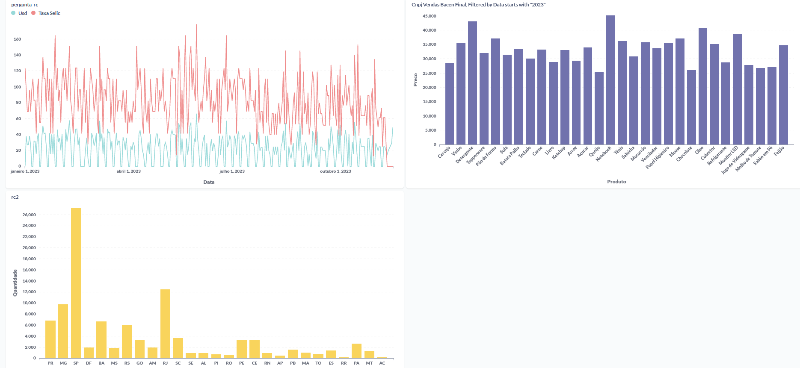

# Relatório de Análise de Dados - Metabase

## Insights a partir dos Gráficos

### Gráfico 1: Relação entre USD e Taxa Selic em 2023

**Importância:** Este gráfico é fundamental para entender a dinâmica entre a taxa de câmbio do USD e a Taxa Selic durante o ano de 2023, influenciando diretamente investimentos e economia.

**Insights:**
- **Correlações Econômicas:** Observar correlações e possíveis impactos entre a Taxa Selic e o USD, como variações cambiais em resposta a mudanças na taxa de juros.
- **Efeito sobre Investimentos:** Compreender como alterações na Taxa Selic podem afetar investimentos em USD e estratégias financeiras.

### Gráfico 2: Quantidade de Produtos por Estado

**Importância:** Esse gráfico oferece uma visão geográfica da distribuição de produtos por estado, fornecendo insights valiosos para estratégias de mercado.

**Insights:**
- **Geolocalização de Demanda:** Identificar estados com maior demanda por produtos específicos para direcionar estratégias de distribuição e marketing.
- **Tendências de Consumo Regional:** Observar variações na quantidade de produtos por estado para compreender preferências regionais de consumo.

### Gráfico 3: Preços por Produto

**Importância:** Essa representação visual dos preços de produtos permite a análise das variações de preço ao longo do tempo ou entre diferentes itens.

**Insights:**
- **Análise de Tendências de Preços:** Identificar flutuações e padrões de preços ao longo do tempo para compreender o comportamento do mercado.
- **Comparação de Preços:** Comparar os preços entre diferentes produtos auxilia em estratégias de precificação e posicionamento no mercado.

Cada gráfico oferece insights valiosos para a compreensão do mercado, economia e estratégias de negócio.
